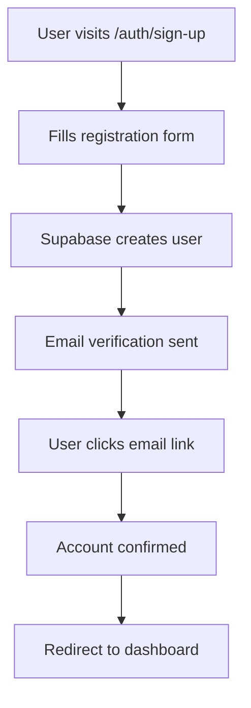
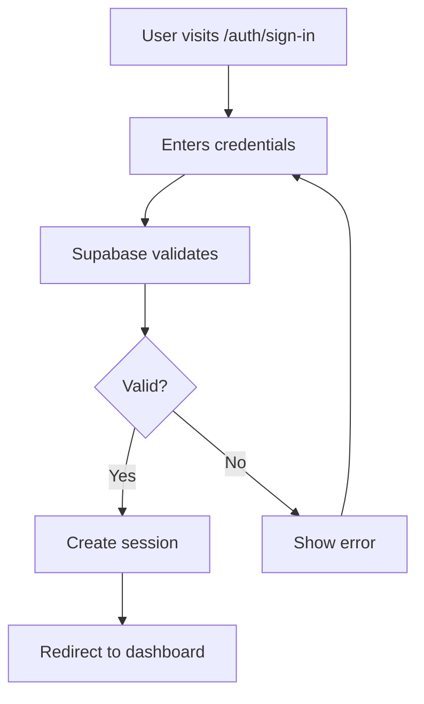

# Authentication Overview

Learn how authentication works in your SaaS starter and how to customize it for your needs.

## Architecture

Your authentication system is built with:

- **Supabase Auth**: Handles user registration, login, and session management
- **Next.js Middleware**: Protects routes and manages redirects
- **React Server Components**: Server-side authentication checks
- **TypeScript**: Full type safety for auth states

## Authentication Flow

### 1. User Registration



### 2. User Login



## Available Auth Methods

### Email & Password

The default authentication method:

```typescript
// Sign up
const { data, error } = await supabase.auth.signUp({
  email: "user@example.com",
  password: "securepassword",
  options: {
    emailRedirectTo: `${origin}/auth/confirm`,
  },
});

// Sign in
const { data, error } = await supabase.auth.signInWithPassword({
  email: "user@example.com",
  password: "securepassword",
});
```

### Social Authentication

OAuth providers (when configured):

```typescript
// Google OAuth
const { data, error } = await supabase.auth.signInWithOAuth({
  provider: "google",
  options: {
    redirectTo: `${origin}/auth/callback`,
  },
});

// GitHub OAuth
const { data, error } = await supabase.auth.signInWithOAuth({
  provider: "github",
  options: {
    redirectTo: `${origin}/auth/callback`,
  },
});
```

### Magic Links

Email-based passwordless authentication:

```typescript
const { data, error } = await supabase.auth.signInWithOtp({
  email: "user@example.com",
  options: {
    emailRedirectTo: `${origin}/auth/confirm`,
  },
});
```

## Route Protection

### Server-Side Protection

Use in Server Components and API routes:

```typescript
import { createServerComponentClient } from "@supabase/auth-helpers-nextjs";
import { cookies } from "next/headers";
import { redirect } from "next/navigation";

export default async function ProtectedPage() {
  const supabase = createServerComponentClient({ cookies });
  const {
    data: { session },
  } = await supabase.auth.getSession();

  if (!session) {
    redirect("/auth/sign-in");
  }

  return <div>Protected content for {session.user.email}</div>;
}
```

### Client-Side Protection

Use in Client Components:

```typescript
"use client";

import { useEffect, useState } from "react";
import { createClientComponentClient } from "@supabase/auth-helpers-nextjs";
import { useRouter } from "next/navigation";

export default function ClientProtectedComponent() {
  const [user, setUser] = useState(null);
  const router = useRouter();
  const supabase = createClientComponentClient();

  useEffect(() => {
    const getUser = async () => {
      const {
        data: { session },
      } = await supabase.auth.getSession();
      if (session) {
        setUser(session.user);
      } else {
        router.push("/auth/sign-in");
      }
    };

    getUser();
  }, [router, supabase]);

  if (!user) return <div>Loading...</div>;

  return <div>Protected content for {user.email}</div>;
}
```

### Middleware Protection

Automatic route protection with middleware:

```typescript
// middleware.ts
import { createMiddlewareClient } from "@supabase/auth-helpers-nextjs";
import { NextResponse } from "next/server";
import type { NextRequest } from "next/server";

export async function middleware(req: NextRequest) {
  const res = NextResponse.next();
  const supabase = createMiddlewareClient({ req, res });

  const {
    data: { session },
  } = await supabase.auth.getSession();

  // Protect dashboard routes
  if (req.nextUrl.pathname.startsWith("/dashboard") && !session) {
    return NextResponse.redirect(new URL("/auth/sign-in", req.url));
  }

  return res;
}

export const config = {
  matcher: ["/dashboard/:path*"],
};
```

## User Management

### Getting User Information

```typescript
// Get current user
const {
  data: { user },
} = await supabase.auth.getUser();

// User properties available:
console.log(user?.id); // Unique user ID
console.log(user?.email); // User email
console.log(user?.created_at); // Account creation date
console.log(user?.user_metadata); // Custom user data
```

### Updating User Profile

```typescript
const { data, error } = await supabase.auth.updateUser({
  email: "new@example.com",
  password: "newpassword",
  data: {
    full_name: "John Doe",
    avatar_url: "https://example.com/avatar.jpg",
  },
});
```

### User Roles & Permissions

Add custom claims to user metadata:

```typescript
// During sign up
const { data, error } = await supabase.auth.signUp({
  email: "admin@example.com",
  password: "password",
  options: {
    data: {
      role: "admin",
      permissions: ["read", "write", "delete"],
    },
  },
});

// Check user role
const isAdmin = user?.user_metadata?.role === "admin";
```

## Session Management

### Listening to Auth Changes

```typescript
"use client";

import { useEffect } from "react";
import { createClientComponentClient } from "@supabase/auth-helpers-nextjs";

export default function AuthListener() {
  const supabase = createClientComponentClient();

  useEffect(() => {
    const {
      data: { subscription },
    } = supabase.auth.onAuthStateChange((event, session) => {
      if (event === "SIGNED_IN") {
        console.log("User signed in:", session?.user);
      }
      if (event === "SIGNED_OUT") {
        console.log("User signed out");
      }
    });

    return () => subscription.unsubscribe();
  }, [supabase]);

  return null;
}
```

### Manual Session Refresh

```typescript
const { data, error } = await supabase.auth.refreshSession();
```

### Sign Out

```typescript
const { error } = await supabase.auth.signOut();
```

## Email Templates

Customize auth emails in your Supabase dashboard:

### 1. Confirmation Email

**Path**: Authentication > Email Templates > Confirm signup

```html
<h2>Confirm your signup</h2>
<p>Follow this link to confirm your user:</p>
<p><a href="{{ .ConfirmationURL }}">Confirm your mail</a></p>
```

### 2. Password Reset

**Path**: Authentication > Email Templates > Reset password

```html
<h2>Reset Password</h2>
<p>Follow this link to reset the password for your user:</p>
<p><a href="{{ .ResetPasswordURL }}">Reset Password</a></p>
```

### 3. Magic Link

**Path**: Authentication > Email Templates > Magic Link

```html
<h2>Magic Link</h2>
<p>Follow this link to login:</p>
<p><a href="{{ .MagicLinkURL }}">Log In</a></p>
```

## Security Best Practices

### 1. Row Level Security (RLS)

Always use RLS policies:

```sql
-- Enable RLS on your tables
ALTER TABLE user_profiles ENABLE ROW LEVEL SECURITY;

-- Create policies
CREATE POLICY "Users can view own profile" ON user_profiles
  FOR SELECT USING (auth.uid() = user_id);

CREATE POLICY "Users can update own profile" ON user_profiles
  FOR UPDATE USING (auth.uid() = user_id);
```

### 2. Environment Variables

Keep sensitive keys secure:

```bash
# Never expose service role key to client
SUPABASE_SERVICE_ROLE_KEY=your_service_role_key

# Safe to expose (starts with 'NEXT_PUBLIC_')
NEXT_PUBLIC_SUPABASE_ANON_KEY=your_anon_key
```

### 3. Session Security

Configure session settings in Supabase:

- **JWT expiry**: Set appropriate session duration
- **Refresh token rotation**: Enable for better security
- **Same site**: Configure for your domain setup

## Troubleshooting

### Common Issues

**Email not received:**

- Check spam folder
- Verify SMTP settings in Supabase
- Ensure email templates are enabled

**OAuth not working:**

- Verify provider configuration
- Check redirect URLs match exactly
- Ensure OAuth apps are approved/published

**Session not persisting:**

- Check middleware configuration
- Verify cookie settings
- Ensure proper server/client component usage

**RLS blocking queries:**

- Review your RLS policies
- Check user authentication in policies
- Use service role key for admin operations

## Next Steps

- [Set up social authentication](/docs/social-auth) - Configure OAuth providers
- [Learn about database setup](/docs/database-setup) - Create user tables
- [Explore user sign-in flows](/docs/sign-in-up) - Customize auth pages
